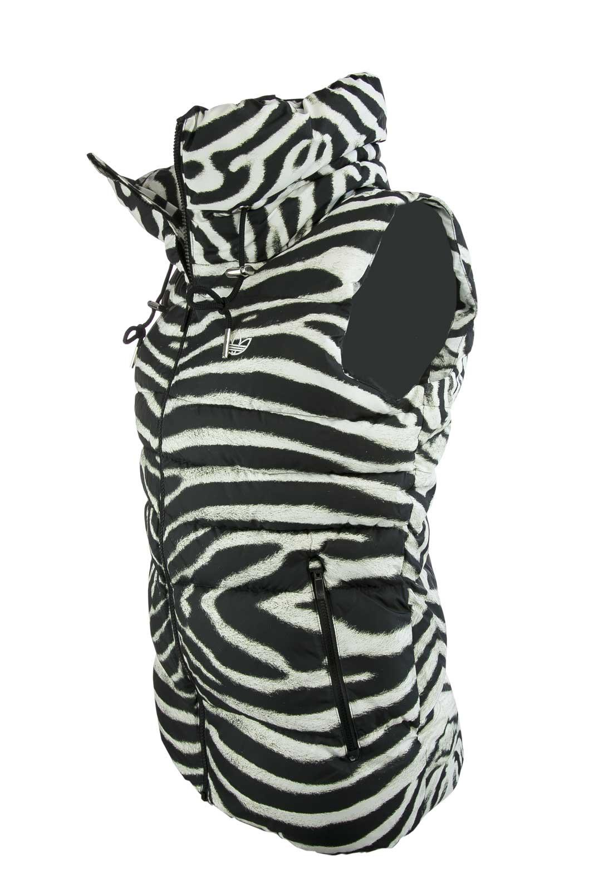
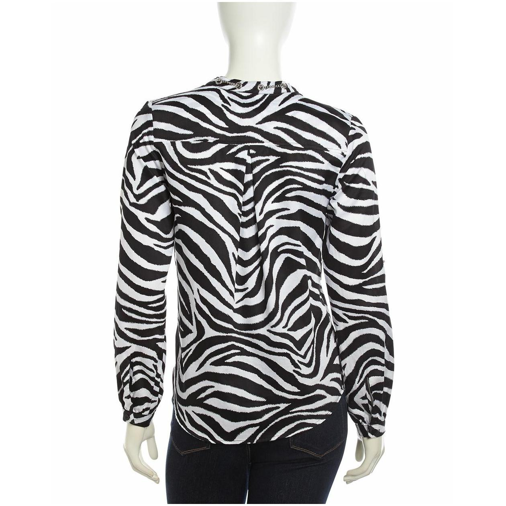
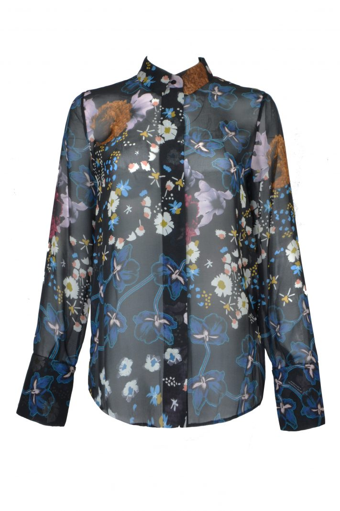
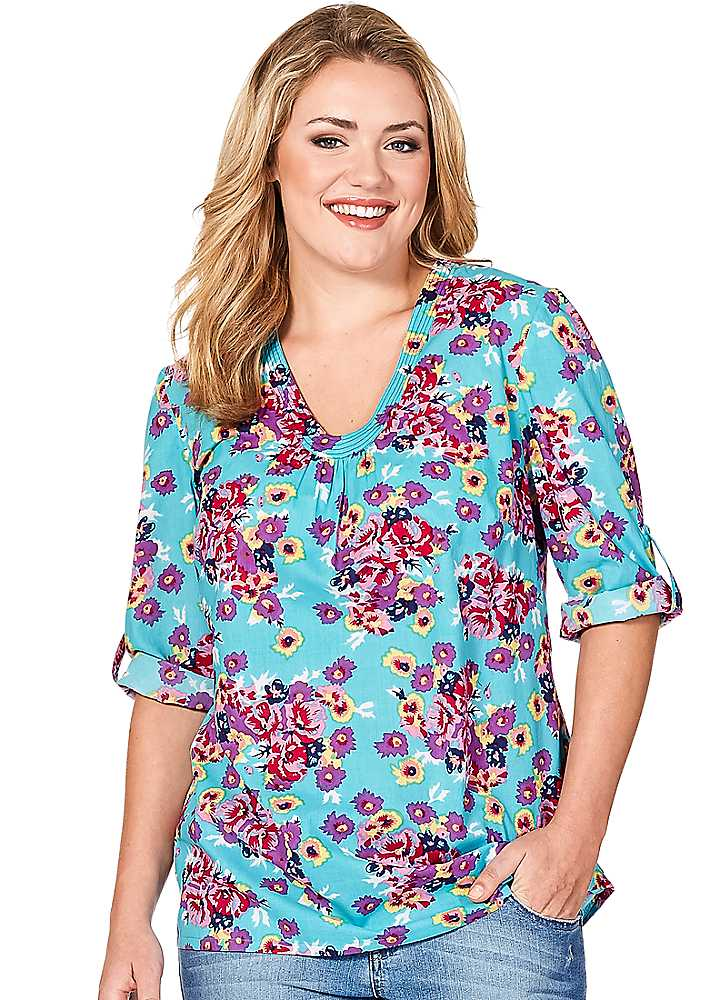
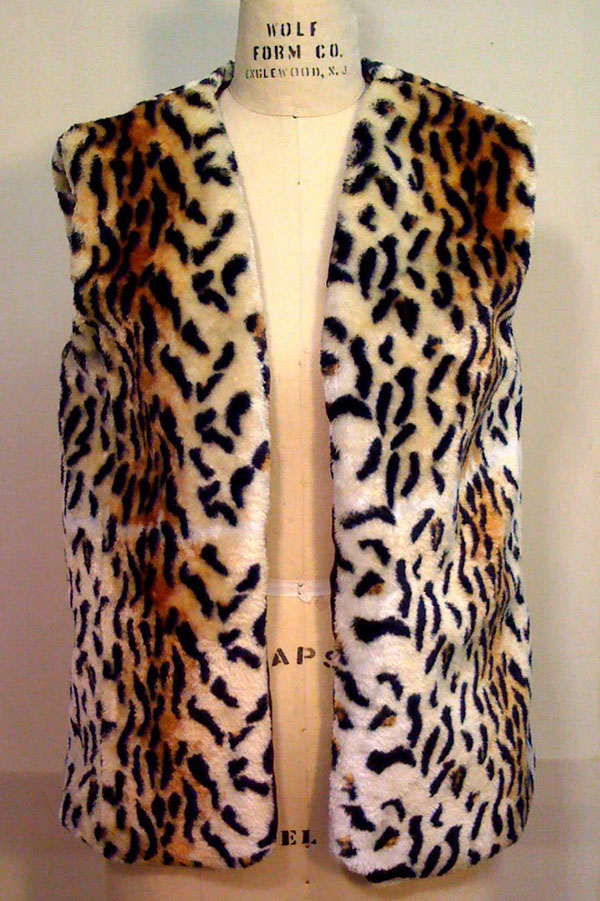

## For the Data Scientist - Develop with Python
----------------------------

    

        

            <li><a href="#first">{{ site.solution_name }}</a></li>
            <li><a href="#system-requirements">System Requirements</a></li>
            <li><a href="#step1">Step1: Pre-Processing and Cleaning</a></li>
            <li><a href="#step2">Step2: Feature Engineering</a></li>
            <li><a href="#step3r">Step3: Splitting, Training, Testing and Evaluating</a></li>
            <li><a href="#template-contents">Template Contents</a></li>
        

    

    

        Microsoft Machine Learning Services provide an extensible, scalable platform for integrating machine learning tasks and tools with the applications that consume machine learning services. It includes a database service that runs outside the SQL Server process and communicates securely with R and Python. 
        

       This solution package shows how to pre-process images (cleaning and feature engineering), train prediction models, and perform scoring on the SQL Server machine with Python.  

    

Scientists who are testing and developing solutions can work from the convenience of their preferred IDE on their client machine, while <a href="https://msdn.microsoft.com/en-us/library/mt604885.aspx">setting the computation context to SQL</a> (see  **Python** folder for code).  They can also deploy the completed solutions to SQL Server 2017 by embedding calls to R or Python in stored procedures (see **SQLPy** folder for code). These solutions can then be further automated by the use of SQL Server Integration Services and SQL Server agent: a PowerShell script (.ps1 file) automates the running of the SQL code.

## {{ site.solution_name }}
--------------------------

To try this out yourself, see the [Quick Start](quick.html) section on the main page.  

This page describes what happens in each of the steps: 

## System Requirements
--------------------------

    



This code was tested using SQL Server 2017, and assumes that SQL Server with Python Service was installed. The installation process can be found [here](install.md).

PRE-PROCESSING
--------------

Suppose the images are already saved in the disk, we want to upload the images to SQL Server and simulate an scenario where all the images are already in SQL Server.

The first step is to create a imagesbase called `ImageSimilarity` with FileTable enabled in SQL Server. Follow the instructions [here](https://docs.microsoft.com/en-us/sql/relational-imagesbases/blob/enable-the-prerequisites-for-filetable)
to set it up. Execute [create_imagesbase_with_filetable.sql](SQLPy/create_imagesbase_with_filetable.sql) to create the imagesbase and allow it to support FileTables. If you do not run this script to create imagesbase, the power-shell script [run_image_similarity.ps1](SQLPy/run_image_similarity.ps1)
will create the imagesbase if the imagesbase does not exist. The power-shell script will create the FileTable as well. Additionally you could execute [create_file_table.sql](SQLPy/create_file_table.sql) to create a FileTable called `ImageStore` separately.

Once you create the FileTable in SQL Server, you will get the directory of the FileTable, then you can upload the images into SQL FileTable by copying the images from the disk and pasting to the directory of FileTable `ImageStore`.  Here the directory of the FileTable is
`\\computer-name\MSSQLSERVER\FileTableimages\ImageStore`. In the power-shell script, we provide power-shell command to copy the image folders into the FileTable directory. Another way to upload the image to FileTable is to execute [copy_images_into_filetable.py](Python/copy_images_into_fileTable.py) to upload the images.

SQL TABLES
--------------
Here we list the tables used in this solution template. But users can change the tables' name and use any name you want. The table name can be specified in each stored procedure or specified when you run the powershell script.

<table class="table" >
	<thead>
		<tr>
			<th>Table</th>
			<th>Description</th>
		</tr>
	</thead>
	<tbody>
		<tr>
			<td>dbo.ImageStore</td>
            <td>FileTable, used to save the images</td>
        </tr>
        <tr>
			<td>dbo.features</td>
            <td>SQL table which used to save images' path, label and DNN features</td>
        </tr>
        <tr>
			<td>dbo.training_images</td>
            <td>training images</td>
        </tr>
        <tr>
			<td>dbo.testing_images</td>
            <td>testing images</td>
        </tr>
        <tr>
			<td>dbo.evaluation_images</td>
            <td>image pairs used to evaluate the model</td>
        </tr>
        <tr>
			<td>dbo.scores</td>
            <td>predicted scores of all the images</td>
        </tr>
        <tr>
			<td>dbo.model</td>
            <td>trained model</td>
        </tr>
        <tr>
			<td>dbo.query_images</td>
            <td>query images</td>
        </tr>
        <tr>
			<td>dbo.ranking_results</td>
            <td>ranked candidates for all the query images</td>
        </tr>
    </tbody>
</table>

SQL WORKFLOW
--------------

### Step 1: Featurization of images with pre-trained DNN model

This step generates features from the images using a pre-trained Resnet in `microsoftml`. The input is the FileTable `@image_table` which contains the images, the output is the SQL Table `@feature_table` which saves the images' path, label,
and DNN features. The dimension of the features depends on which Resnet Model is used in this step. Here we used Resnet18 which generates 512-dimensional features for each image.
The stored procedure [sp_01_featurize_images.sql](SQLPy/sp_01_featurize_images.sql) contains three steps:

1. First, get the images path from the FileTable, map the distinct categories of all the images to factor labels.

2. Second, get a label for each image based on the its category.

3. Third, calculate the features using `microsoftml` library given the images path. You can find the code in [image_similarity_utils.py](image_similarity/image_similarity_utils.py).

### Step 2: Prepare training/testing/evaluation set

This step prepares the training/testing/evaluation image set. Here is the detail information about how to generate training/testing/evaluation set:

1. Randomly split all the images into training/testing set based on category information and train/test ratio, users can change the parameter `@ratioTrainTest` according to the number of total images they have. For example, if the `@ratioTrainTest = 0.7`, then for each category, randomly select 70% images as training images and the left 30% images as testing images.

2. Once the testing images were inserted into the SQL table, we generate evaluation image set based on testing images since we do not want to evaluation images overlap with the training images.

3. Randomly select images from each category as query images, and then randomly select 1 positive image from the same category and some negative images from the other categories. So for each query image, we create 101 image pairs. Users also can set up parameter `@queryImagePerCat`
 to decide how many query images they want to select from each category, and set up parameter `@negImgsPerQueryImg` to decide how many negative images they want to select for each query image.

4. For example, in this sample, we set up `@queryImagePerCat = 20` and `@negImgsPerQueryImg = 100`, finally, the evaluation set contains 220 query images since the image images contains 11 categories, and each query image has 101 candidates (1 positive image and 100 negative images). The script is [sp_02_prepare_images.sql](SQLPy/sp_02_prepare_images.sql).

### Step 3: Training multi-class classifier

Once the features are computed, and the training images and testing images are inserted into the SQL table, we can use them to train a neural network model using `microsoftml` library and then save the model into SQL table.
1. Get the DNN features for the training images and testing images from the feature table `@feature_table`, then train multi-class classifier using neural network algorithm in `microsoftml` library. Finally, evaluate the performance of the classifier using testing images.

2. Overall accuracy is calculated to measure the performance of the classifier.

<table class="table" >
	<thead>
		<tr>
			<th>Pre-trained model</th>
			<th>Classifier</th>
            <th>Accuracy on train set</th>
			<th>Accuracy on test set</th>
		</tr>
	</thead>
	<tbody>
		<tr>
			<td>Resnet18</td>
            <td>rx_neural_network</td>
            <td>89.7%</td>
            <td>75.1%</td>
        </tr>
    </tbody>
</table>

3. Get the predicted scores of all the images in training and testing table using trained classifier, and save the predicted scores into SQL table `@scores_table`. Here we use all the images as the candidates for the last step. Users also can have their own candidate images. To get the predicted scores for users' own candidate images, first, you have to featurize the candidate images using pre-trained Resnet, and then load the classifier to calculate the predicted scores for your own candidate images. The code can be find in the script [sp_03_train_model.sql](SQLPy/sp_03_train_model.sql).

### Step 4: Evaluate model

Once the model and the predicted scores of all the images are saved into SQL table, we can get the predicted scores from the `@scores_table` for all the image pairs in evaluation table `@evaluation_table`. Based on the predicted scores, we can calculate the distance between each image pair to measure
their similarity so that we can evaluate the performance of the model in terms of ranking.
1. Load the predicted scores for all the images, for example, in this sample, the image images contains 11 categories, so the predicted score is a 11-dimensional vector for each image.

2. Load the image pairs from the evaluation table, for each image pair, we can get two 11-dimensional vectors, we calculate L2 and Cosine distance between these two vectors to measure the similarity. So for each image pair, we get two distances.

3. We calculate top 1, 2, 4, 5, 8, 10, 15, 20, 28 and 32 accuracy to measure the ranking performance. The code can be found in script [sp_04_evaluate_model.sql](SQLPy/sp_04_evaluate_model.sql).

4. Ranking performance on evaluation images.

    

    
    

### Step 5: Ranking candidates for each query image

Once the accuracy of the image ranking system satisfy the requirement, we can rank the candidates for the query images. This script [sp_05_rank_candidates.sql](SQLPy/sp_05_rank_candidates.sql) mainly serves four purpose:

1. In order to get the similar images for each query image quickly, we have to make the predicted scores of all the candidate images ready before this step. We explained how to get the predicted scores for users' own candidate images in step 3. So we assume
the predicted scores of all the candidate images are already saved in SQL table `@scores_table`, we just need to load the predicted scores for all the candidate images from the SQL table. We don't need to calculate them in this step.

2. Assume all the query images are already saved in SQL table `@query_table`. we load the query images from the SQL table, and then featurize the query images using pre-trained Resnet, here you have to used the same pre-trained model which used in the step 1.

3. Load the model which trained in step 3 form SQL table `@model_table`, and calculate the predicted scores for all the query images using the model.

4. Calculate the Cosine distance between each query image and all the candidates, based on the distance, return top K similar images for each query images. Users can set up parameter `@topKCandites` to decide how many similar images should be returned for each query image.
 For example, here we set `@topKCandidates` equal to 5, so in the result table `@results_table`, each query image has 5 similar images.

The following table shows a sample results in result table `@results_table`.

<table class="table"  >
	<thead>
		<tr>
			<th>Query_Images</th>
			<th>Top_5_Candidates</th>
			<th>Distance</th>
		</tr>
	</thead>
	<tbody class="mid">
		<tr>
			<td> zebra\3135.jpg</td>
            <td> zebra\3135.jpg</td>
            <td>0</td>
        </tr>
        <tr>
			<td></td>
            <td> zebra\101.jpg</td>
            <td>6.05E-09</td>
        </tr>
        <tr>
			<td></td>
            <td> zebra\839.jpg</td>
            <td>8.48E-08</td>
        </tr>
        <tr>
			<td></td>
            <td> zebra\2311.jpg</td>
            <td>8.65E-08</td>
        </tr>
        <tr>
			<td></td>
            <td> zebra\802.jpg</td>
            <td>2.02E-07</td>
        </tr>
        <tr>
			<td> floral\2562.jpg</td>
            <td> floral\2562.jpg</td>
            <td>0</td>
        </tr>
        <tr>
			<td></td>
            <td> floral\2590.jpg</td>
            <td>0.000515907</td>
        </tr>
        <tr>
			<td></td>
            <td> floral\3316.jpg</td>
            <td>0.001025471</td>
        </tr>
        <tr>
			<td></td>
            <td> floral\2568.jpg</td>
            <td>0.00104754</td>
        </tr>
        <tr>
			<td></td>
            <td> floral\4025.jpg</td>
            <td>0.001170971</td>
        </tr>
        <tr>
			<td> leopard\3093.jpg</td>
            <td> leopard\3093.jpg</td>
            <td>1.11E-16</td>
        </tr>
        <tr>
			<td></td>
            <td> leopard\2386.jpg</td>
            <td>4.72E-07</td>
        </tr>
        <tr>
			<td></td>
            <td> leopard\875.jpg</td>
            <td>5.72E-07</td>
        </tr>
        <tr>
			<td></td>
            <td> leopard\2393.jpg</td>
            <td>1.28E-06</td>
        </tr>
        <tr>
			<td></td>
            <td> leopard\2397.jpg</td>
            <td>1.35E-06</td>
        </tr>

    </tbody>
</table>

### End-to-end run

We provide a powershell script [run_image_similarity.ps1](SQLPy/run_image_similarity.ps1) to run all the steps including create the imagesbase, create the FileTable and copy all the images into the directory of FileTable.
Please follow [here](https://docs.microsoft.com/en-us/sql/relational-imagesbases/blob/enable-the-prerequisites-for-filetable) to enable FILESTREAM at the SQL instance level.

## Template Contents 
---------------------

[View the contents of this solution template](contents.html).

To try this out yourself: 

* View the [Quick Start](quick.html).

[&lt; Home](index.html)
