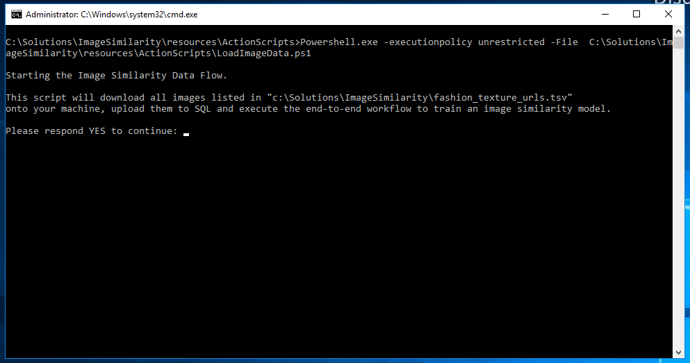

## Azure AI Gallery Deployment

If you deployed this solution from the [Azure AI Gallery]({{ site.aka_url }}), there was one final step to complete the first time you log onto the VM. The command prompt should be opened on the VM, and you must respond YES to download images and complete the solution workflow.

 

If you closed this window or did not respond with a `YES`, your `ImageSimilarity_Py` database will be present but all the tables will be empty. In this case, you can execute the file **LoadImageData.ps1** in the **C:\Solutions\ImageSimilarity\resources\ActionScripts** directory to complete the last step.  This only need to be done once on the machine.