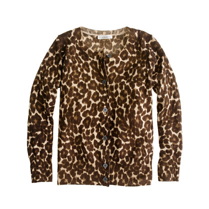

The data we used for this solution is a small upper body clothing texture dataset consisting of 1716 images, where each image is annotated as one of 11 different textures. All images were scraped using Bing Image Search and hand-annotated.

These images are stored in the **data/fashionTexture** directory of this template, in a folder corresponding to their texture:

- argyle
- checkered
- dotted
- floral
- herringbone
- houndstooth
- leopard
- paisley
- striped
- tartan
- zebra
